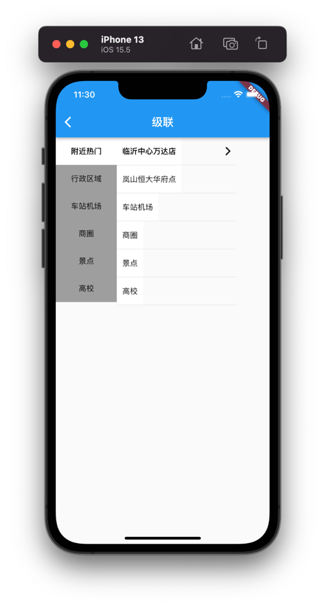

# flutter_common_templates

关于flutter的通用模板

# 列表

## 一、[chat_module](https://github.com/jingluoguo/flutter_common_templates/tree/main/lib/chat_module)
> 基于StatefulWidget刷新状态的交互通用聊天界面

### 1 预览图


### 2 版本

```
flutter: 2.10.3
dart: 2.16.2
```

### 3 插件
```
# 视频播放插件: 背景播放
video_player: ^2.1.1

# 监听键盘: 永远指向最新的消息
flutter_keyboard_visibility: ^5.0.3

# 表情库: 扩展输入内容
emoji_picker_flutter: ^1.0.5
```

## 二、[customer_text_field](https://github.com/jingluoguo/flutter_common_templates/tree/main/lib/customer_text_field)
> 自定义密码输入框

### 1 预览图


### 2 版本

```
flutter: 2.10.3
dart: 2.16.2
```

## 三、[click_position_dialog](https://github.com/jingluoguo/flutter_common_templates/tree/main/lib/click_position_dialog)
> 根据点击位置生成dialog

### 1 预览图


### 2 版本

```
flutter: 2.10.3
dart: 2.16.2
```

## 四、[cascade_module](https://github.com/jingluoguo/flutter_common_templates/tree/main/lib/cascade_module)
> 级联

### 1 预览图



### 2 版本

```
flutter: 2.10.3
dart: 2.16.2
```